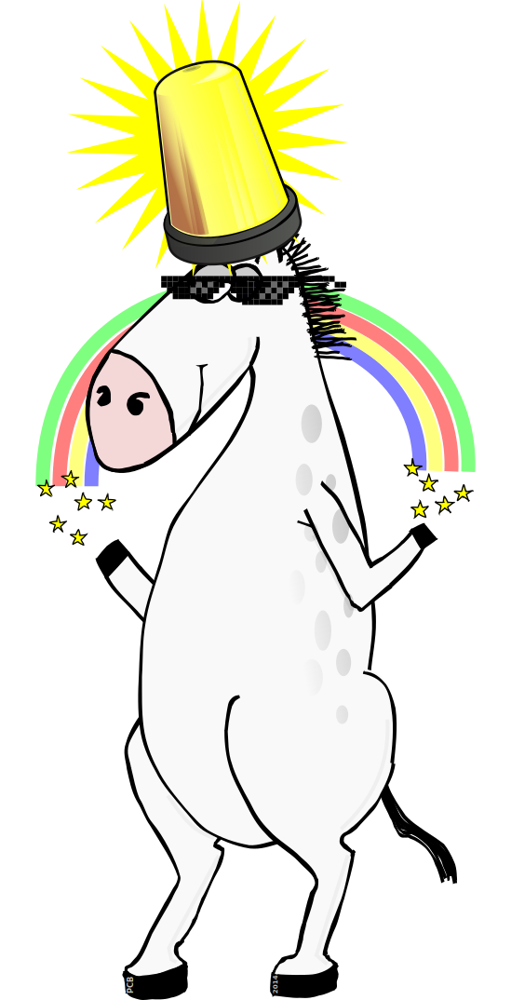

= Entity Component Systems (ECS)
Michael Galetzka / michael.galetzka@disy.net
:backend: revealjs
:revealjs_center: true
:revealjs_theme: nipa-day
:revealjs_history: true
:revealjs_progress: false
:revealjs_mouseWheel: true
:revealjs_parallaxBackgroundImage: images/disy-landscape.jpg
:revealjs_parallaxBackgroundSize: 3246px 1237px
:revealjs_transition: slide

++++
<link rel="stylesheet" href="highlight.js/9.2.0.monokai-sublime.min.css">
<script src="highlight.js/9.2.0.min.js"></script>
<script src="jquery/jquery-2.2.1.min.js"></script>
<script src="reveal.js/js/reveal.js"></script>
<script>
	hljs.initHighlightingOnLoad();
	hljs.configure({tabReplace: '    '})
</script>
++++

== Entity Component Systems (ECS)

++++
<h3>Kurze Umfrage</h3>
++++

* Wer kennt es?
* Wer hat es schon benutzt?

== Beispielanwendung

Wir bauen ein neues 3D Fantasy-Computerspiel mit Drachen, Einhörnern, etc.


Wie würde eine passende Architektur aussehen?

== Klassischer OOP Ansatz

```json
GameObject
|-PhysicsObject
|  |-StaticObject
|  |  |-SceneLight
|  |  |-Tree
|  |-MoveableObject
|     |-Bullet
|     |-GameCharacter
|        |-Unicorn (eat grass, make rainbows, ...)
|        |-Dragon (breathe fire, eat unicorns, ...)
|-ParticleEmitter
|-ScriptObject
|-UtilityObject
```

++++
<div class="imageblock" style="position: absolute; top: 150px; right: 250px;">
  <div class="content">
	  
  </div>
</div>
<div class="imageblock" style="position: absolute; top: 160px; right: 100px;">
  <div class="content">
	  
  </div>
</div>
++++

== Änderungswünsche!

=== Bewegliche Lichter!

*Bisher waren Lichter vom Typ `StaticObject`.*

* Lichter sind ab jetzt `MoveableObject` statt `StaticObject` -> schlechter optimierbar, hat nun unnötige Methoden
* Alternative: ein zweites Licht als `MoveableObject` erstellen -> Code Duplikation oder zumindest Overhead


=== Leuchtende Einhörner

*Unsere Einhörner sind nicht majestätisch genug!*

* Neue `getLightEmitters` Methode für `GameCharacter`? +
 -> viel Overhead und fette API
* Wir "hacken" ein bewegliches Licht, +
 welches dem Einhorn folgt

++++
<div class="imageblock" style="position: absolute; top: 200px; right: 50px;">
 <div class="content">
	  
		<p id="dealLabel" style="
    position: absolute;
    top: 320px;
    background-color: gold;
    color: mediumblue;
    font-weight: bold;
">DEAL WITH IT</p>
 </div>
</div>
<div id="glasses" class="imageblock" style="position: absolute; top: -200px; right: 50px;">
 <div class="content">
	  
 </div>
</div>
<script>
	$("#_leuchtende_einhörner").attr("data-state", "dealWithIt");
	Reveal.addEventListener('dealWithIt', function () {
		$("#dealLabel").css("display", "none");
		$("#glasses").css("top", "-150px");
		$("#glasses").animate({top: "200px"}, 5000, "linear", function() {
			$("#dealLabel").css("display", "block");
		});
	});
</script>
++++

=== Neue Kreatur

*Unser Produzent will für den Plot eine neue Kreatur: den Unidragon (Kreuzung +Unicorn/Dragon+)*


* Err... Refactoring?

== Was lief schief?

* **Inheritance over Composition!**
* Unklare und schnell wechselnde Anforderungen
* Viele verschiedene (mehr oder weniger unabhängige) Akteure => Vermischung der Zuständigkeiten

== ECS to the Rescue!

* **Entities** haben keine Daten und kein Verhalten, sind nur Namen
* **Components** beinhalten ALLE Daten für die Entities, keine Logik
* Die komplette Logik ist in **Systems** enthalten, die über vordefinierte Filter mit Entities versorgt werden

=== Datenbank-Analogie

* _Entities_ sind der Primärschlüssel (= ID)
* _Components_ sind die einzelnen Spalten (=Daten)
* _Systems_ können über Abfragen die für sie wichtigen Zeilen bearbeiten

=== Unser Spiel in ECS Form

```json
Components:
   Position
   Velocity
   Mesh (Wireframe)
   Textures
   LightEmission
   PhysicsInfo (elasticity, mass, roughness, etc.)
   Particle Emission

Systems:
   PhysicsSystem (movement, constraints)
   ScriptSystem
   RenderSystem
   ParticleSystem
   AnimationSystem
```

=== Vergleich

Vorher (Class) <-> Nachher (Entity)

```json
OOP                       ECS

GameObject
  |-MoveableObject
    |-GameCharacter
      |-Unicorn
```

== Änderungswünsche!

=== Bewegliche Lichter!

* Licht-Entities bekommen eine `Velocity`-Component angehängt
* Evtl. muss das `RenderSystem` angepasst werden


=== Leuchtende Einhörner

Einhorn-Entities bekommen eine `LightEmission`-Component angehängt.



=== Neue Kreatur

Neue Kreatur-spezifische Components erzeugen (`Mesh`, `Texture`, `Script`, ...).


== Bewertung

=== Nachteile

* Archetypen, Templates, Factories oder ähnliches notwendig bei komplexeren Projekten
* Oft nur schwer in bereits bestehende Systeme integrierbar
* Naive Implementierung ist sehr langsam
* Debugging ist schwerer (dadurch dass es keine Klassen gibt, fällt es schwer, einzelne Entities wiederzuerkennen und zu verfolgen)

=== Vorteile

* Debuggen ist einfacher (es gibt nur einen Ort für die Logik)
* Klare Trennung zwischen Daten, Akteuren und Verhalten
* Extrem einfach, neue Features sauber in ein bestehendes System einzufügen -> sehr gut für Prototyping geeignet
* Einfaches einbinden von third-party Libs möglich
* *Data-Driven Design!*

=== Mehr Vorteile!

* *Lightning FAST* (Cache optimiert; kommt natürlich auf Implementierung an)
* Komponenten können gepoolt werden
* Einfaches Multithreading möglich (ein Thread pro System)
* Einfache Serialisierung aller Daten

== Frameworks

* https://github.com/libgdx/ashley[Ashley] (Java)
* https://github.com/junkdog/artemis-odb[Artemis-ODB] (Java)
* https://github.com/vinova/Artemis-Cpp[Artemis Port] (C++)
* https://github.com/thelinuxlich/artemis_CSharp[Artemis C# Port] (C#)
* https://github.com/alecthomas/entityx[EntityX] (C++)
* https://github.com/miguelmartin75/anax[anax] (C++)
* https://github.com/sschmid/Entitas-CSharp[Entitas] (C#)

== Fazit

* ECS werden *seit Jahren erfolgreich* in der Spieleentwicklung eingesetzt.
* Gutes Architekturpattern um mit *sehr dynamischen Anforderungen* umzugehen.
* Für bestehende Systeme lohnt sich der Umbau oft nicht, bei *Neuentwicklungen* sollte man aber darüber nachdenken :)

== Fragen?
